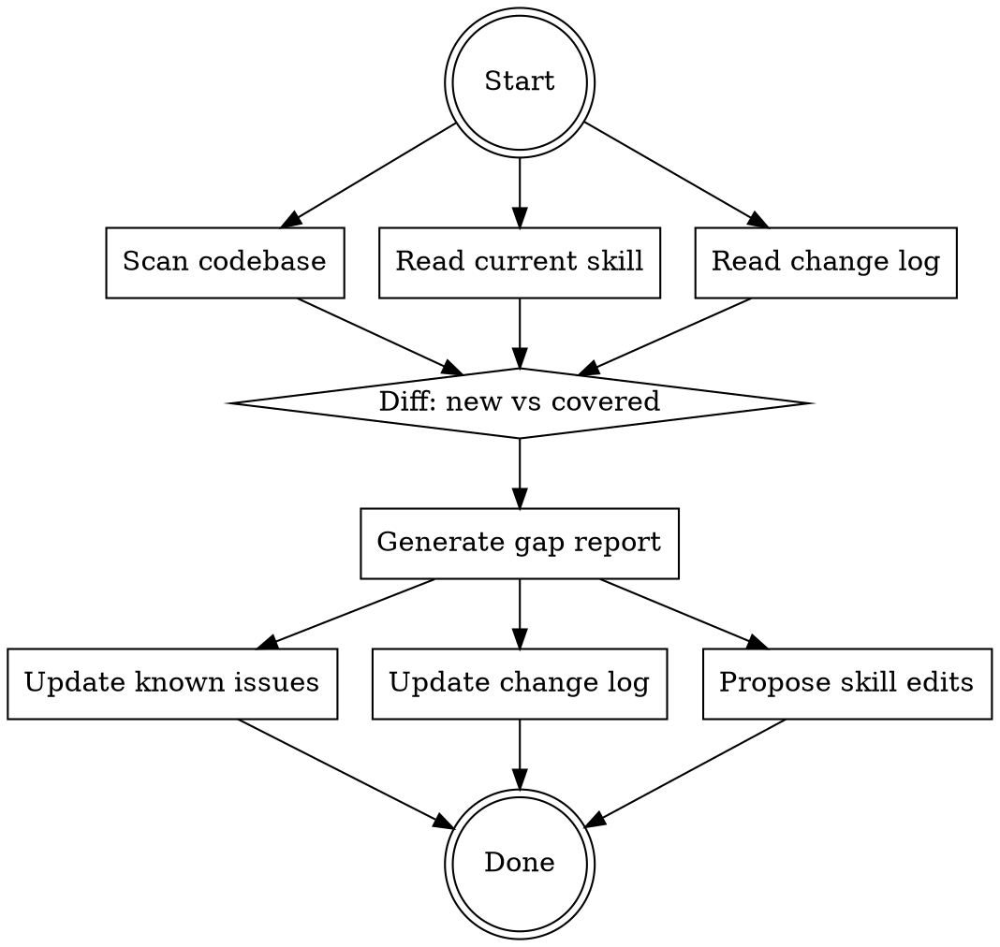

# Sync Beta Test Coverage

## Overview

Deep codebase analysis that keeps the `beta-testing-propertyiq` skill current. Compares what exists in the codebase against what the testing skill covers, identifies gaps, and updates both the skill and the change log.

**Run this:** Weekly, before major test sessions, or after significant refactors.

**REQUIRED:** You must understand `beta-testing-propertyiq` before using this skill.

## When to Run

- Before any beta testing session
- After merging a feature branch
- After significant refactors (e.g., data pipeline consolidation, new service extraction)
- Weekly maintenance

## The Sync Process



### Step 1: Full Codebase Scan

Scan these areas and build a complete inventory:

**Routes:**
```
Glob: packages/frontend/app/**/page.tsx
```
Parse directory structure → URL paths. Categorize as public/auth-gated/admin/dynamic.

**API Endpoints:**
```
Grep: @Controller.*'([^']+)' in packages/backend/src/**/*.controller.ts
Grep: @(Get|Post|Put|Delete|Patch)\( in packages/backend/src/**/*.controller.ts
```
Build endpoint map. Check for `@UseGuards` on each.

**Metrics:**
```
Read: packages/frontend/lib/data/registry.ts
Read: packages/frontend/app/map/config/metrics.ts
Read: packages/frontend/lib/data/definitions.ts
```
All metric IDs, formats, supported geos, data sources.

**Entitlements:**
```
Read: packages/frontend/lib/entitlements/types.ts
Glob: packages/frontend/components/entitlements/*.tsx
```
Tier types, gating components, access patterns.

**Data Layer:**
```
Glob: packages/frontend/lib/data/fetchers/*.ts
Glob: packages/frontend/lib/data/hooks/*.ts
Read: packages/backend/src/metric-resolution/fallback-registry.ts
Read: packages/backend/src/metric-resolution/metric-resolution.types.ts
```
All fetchers, hooks, fallback chains, resolved metric structure.

**Backend Services:**
```
Glob: packages/backend/src/**/*.service.ts
Glob: packages/backend/src/**/*.controller.ts
Glob: packages/backend/src/**/*.module.ts
```
All NestJS modules, services, dependency graph.

**Admin Pages:**
```
Glob: packages/frontend/app/admin/**/page.tsx
```
All admin surfaces.

**Scoring:**
```
Glob: packages/frontend/app/components/scoring/*.tsx
Glob: packages/backend/src/scoring/**/*.ts
```

### Step 2: Git History Analysis

```bash
# Changes since last sync (or last 2 weeks)
git log --since="2 weeks ago" --name-status --pretty=format:"%h %s" -- packages/

# Semantic categorization of changed files
git diff --stat HEAD~50..HEAD -- packages/frontend/app/     # Route changes
git diff --stat HEAD~50..HEAD -- packages/backend/src/       # API changes
git diff --stat HEAD~50..HEAD -- packages/frontend/lib/data/ # Data layer changes
git diff --stat HEAD~50..HEAD -- packages/frontend/lib/entitlements/ # Gating changes
git diff --stat HEAD~50..HEAD -- packages/frontend/components/entitlements/ # Paywall changes
git diff --stat HEAD~50..HEAD -- packages/backend/src/metric-resolution/ # Resolution changes
git diff --stat HEAD~50..HEAD -- packages/backend/src/scoring/ # Score changes
git diff --stat HEAD~50..HEAD -- packages/backend/src/admin/  # Admin changes
```

For each changed area, read the actual diff to understand WHAT changed (not just that it changed).

### Step 3: Read Current Skill Coverage

```
Read: .claude/skills/beta-testing-propertyiq/SKILL.md
```

Extract:
- All URLs/pages mentioned in test phases
- All API endpoints referenced
- All metric IDs referenced
- All components referenced
- All known issues listed

### Step 4: Diff — Find Gaps

Compare codebase inventory against skill coverage:

| Category | Codebase Has | Skill Covers | Gap |
|----------|-------------|-------------|-----|
| Routes | X pages | Y pages mentioned | X-Y untested pages |
| API Endpoints | X endpoints | Y referenced | X-Y untested endpoints |
| Metrics | X registered | Y tested | X-Y untested metrics |
| Entitlement Components | X | Y | X-Y |
| Data Fetchers | X | Y | X-Y |
| Admin Pages | X | Y | X-Y |

### Step 5: Semantic Change Analysis

For each significant change in git history, answer:

1. **What user-visible behavior changed?** (new page, new feature, changed data flow)
2. **What testing is needed?** (which phases, which checks)
3. **Does this affect existing test coverage?** (changed component behavior, removed feature)
4. **Is there a new known issue?** (found during analysis)

### Step 6: Update Outputs

#### A. Update Change Log

Write to `.claude/beta-test/change-log.md`:

```markdown
## Sync: [date]

### New Testable Surfaces
- [NEW] Route: /path/to/page — [description]
- [NEW] API: POST /api/endpoint — [description]
- [NEW] Metric: metric_id — [description]

### Changed Surfaces
- [CHANGED] packages/backend/src/metric-resolution/ — Added ResolvedMetric consolidation
- [CHANGED] packages/frontend/lib/data/hooks/ — New useResolvedMetric hook

### New Known Issues
- [ISSUE] P1: New fetcher X doesn't surface source metadata
- [ISSUE] P2: New component Y has no loading state

### Coverage Gaps
- [GAP] Route /new-page has no test coverage in any phase
- [GAP] New API endpoint has no auth guard

### Removed Surfaces
- [REMOVED] Old fetcher replaced by unified data layer
```

#### B. Update Known Issues in Skill

If new issues discovered during analysis, add them to the "Known Code-Level Issues" table in the beta testing skill.

#### C. Propose Skill Edits

For significant gaps, propose specific additions to the beta testing skill:

```markdown
### Proposed Skill Updates

1. **Phase 1 addition:** New metric `redfin_median_sale_price` needs fallback chain testing
   - Added to fallback-registry.ts with chain: Redfin → Zillow → Census
   - No frontend info icon shows Redfin as source yet

2. **Phase 8 addition:** New admin page `/admin/data-quality` needs testing
   - Shows data freshness per source per geography
   - Manual refresh triggers

3. **Known issues update:** MetricResolutionService now returns source metadata
   - Check if frontend hooks consume it
   - Check if info icons display it
```

Present proposed edits to user for approval before modifying the skill file.

### Step 7: Save Inventory Snapshot

Write to `.claude/beta-test/surface-inventory.json`:

```json
{
  "syncDate": "2026-02-21",
  "routes": {
    "public": ["/", "/map", "/graphs", ...],
    "authGated": ["/dashboard", "/account", ...],
    "admin": ["/admin", "/admin/data", ...],
    "dynamic": ["/market/[id]", "/reports/[id]", ...]
  },
  "apiEndpoints": {
    "public": ["GET /api/metrics/*", ...],
    "admin": ["GET /api/admin/features/matrix", ...],
    "guarded": ["GET /api/entitlements/check", ...]
  },
  "metrics": ["home_value", "rent_index", "unemployment_rate", ...],
  "entitlementComponents": ["PaywallCard", "GeoLockCard", ...],
  "dataFetchers": ["fetchSnapshotData", "fetchTimeSeriesData", ...],
  "dataHooks": ["useSnapshotData", "useTimeSeriesData", ...],
  "fallbackChains": {
    "home_value": ["zillow:zhvi", "census:median_home_value", "realtor:median_listing_price"]
  },
  "scoringComponents": ["ScoreWidget", "ScoreBadge", ...]
}
```

This snapshot is read by the beta testing skill's Phase 0 and compared against next sync.

## Quick Reference: File Locations

| What | Where |
|------|-------|
| Beta testing skill | `.claude/skills/beta-testing-propertyiq/SKILL.md` |
| Change log | `.claude/beta-test/change-log.md` |
| Surface inventory | `.claude/beta-test/surface-inventory.json` |
| Git hook | `scripts/hooks/beta-test-change-tracker.sh` |
