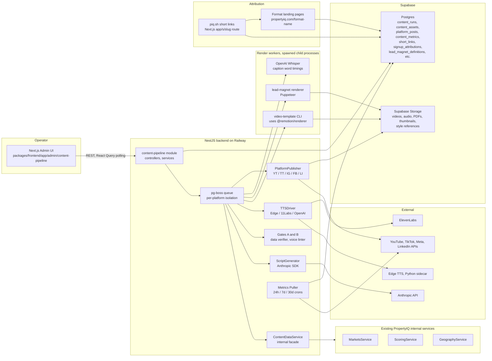
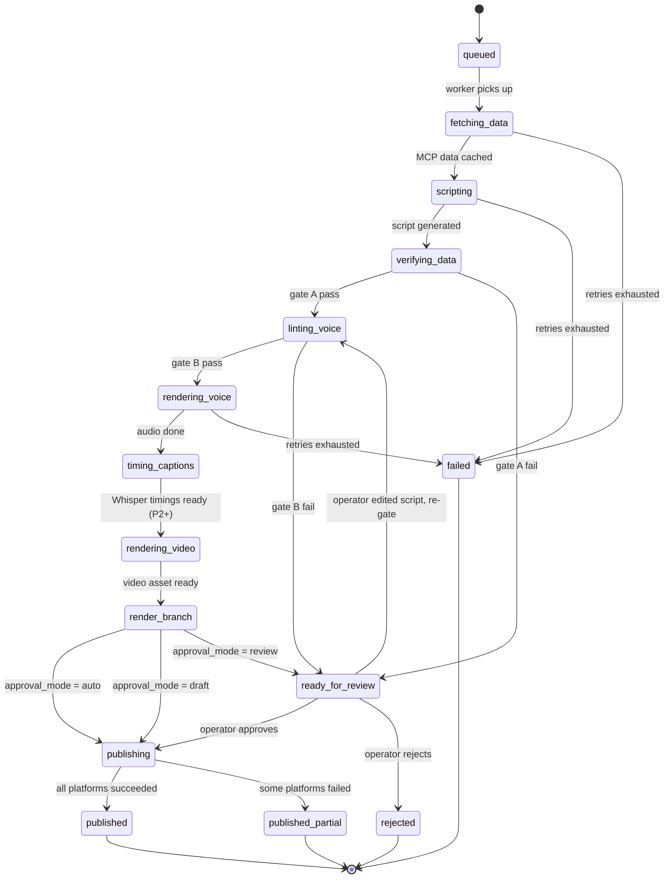

# PropertyIQ Content Pipeline: Design Specification

## Changelog

- 2026-04-21, v1.0: initial design, produced from a brainstorming session that refined the brief at `docs/plans/2026-04-21-propertyiq-content-pipeline-brief.md` into a concrete architecture and phasing plan.

## Executive summary

PropertyIQ is automating the production and multi-platform publishing of faceless, data-driven real estate video content. A solo operator (Troy) uses the existing PropertyIQ admin UI to create runs. The backend fetches live market data from the PropertyIQ data layer, generates a platform-specific script with Claude, synthesizes voice, renders video in Remotion, and distributes to YouTube Shorts and long-form, TikTok, Instagram Reels, Facebook Reels, and LinkedIn. Every published video carries a unique tracking short link that closes the loop from view to PropertyIQ account signup, attributing downstream tier-upgrade revenue to the exact video that drove it.

Primary business goal: drive agent and broker tier signups on propertyiq.com. Secondary goal: grow a standalone faceless channel audience as an owned distribution asset. The content pipeline serves both goals simultaneously by producing two audience tracks (five investor-oriented formats and three agent/broker-oriented formats) through a single shared production pipeline, with audience-specific lead magnets gated behind PropertyIQ free-tier signup.

The design leverages substantial existing assets: a Remotion video package (`packages/video-template`) already ships with six scene components, two compositions, and three successfully-rendered test videos; the PropertyIQ MCP server exposes 35 data tools that the pipeline will call as internal services rather than over OAuth; Puppeteer is already installed (for Redfin scraping) and will be repurposed for lead magnet PDF rendering; the existing Resend-backed emails package delivers lead magnets with one small extension to support attachments. New infrastructure is limited to: a single new NestJS module (`content-pipeline`), a new Next.js admin section, a pg-boss job queue on the existing Supabase Postgres, and fourteen new DB tables.

Total estimated complexity: 11 to 16 weeks of focused engineering across five phases. Phase 1 (3 to 5 weeks) ships foundation plus one format end-to-end with hard gates, attribution, and initial analytics already wired because a solo operator cannot retrofit trust. Phase 2 (3 to 4 weeks) adds format and platform breadth. Phase 3 (2 to 3 weeks) adds long-form plus the remaining agent/broker formats. Phase 4 (2 weeks) matures analytics and observability. Phase 5 (1 to 2 weeks) ships auto-ideation.

## Goals and non-goals

**Primary goals:**

1. Drive PropertyIQ account signups, with strongest bias toward agent and broker tier conversions (the revenue-generating audience).
2. Grow a standalone faceless channel presence as an owned distribution asset (subscribers, watch time, brand authority).
3. Automate end-to-end so a solo non-marketer operator can ship 20 runs per week with under one hour of daily attention, with the architecture scaling to 80 runs per week by adding workers.

**Non-goals (v1):**

1. Running paid advertising against the content (organic only).
2. Multi-operator collaboration (single-operator assumption throughout).
3. White-labeling the pipeline for other brokerages (the data model stays single-tenant in v1; a future migration is feasible).
4. Faking a human face or avatar (faceless means voice-only; no HeyGen-style synthesized persons).
5. Reproducing competitor content (style references inform presentation parameters, never content).

## Scope and phasing

The brief's original phasing (P1: "Grade Reveal end-to-end with Edge TTS and manual upload") is superseded because the operator-trust requirements, analytics requirements, and attribution requirements cannot be retrofitted onto a pipeline that shipped without them. Revised phasing:

### Phase 1: Foundation plus one format live, end-to-end, with trust baked in

- Database schema for all fourteen content-pipeline tables (migrations committed in four files).
- pg-boss queue infrastructure on the existing Supabase Postgres.
- Pipeline state machine implemented with fourteen states and the approval-mode branch logic.
- ContentDataService internal facade exposing approximately fifteen data methods (one per MCP tool the pipeline uses) that wrap existing PropertyIQ internal services.
- ScriptGenerator, TTSDriver (Edge TTS implementation), VideoRenderer (Remotion CLI spawner), LeadMagnetRenderer (Puppeteer), and PlatformPublisher (YouTube Shorts implementation) abstractions.
- Audit and extension of `packages/video-template`: add a programmatic `renderVideo()` API, a CLI entry point spawnable from the backend, and a format factory; extend existing scenes to support dynamic aspect/duration.
- Brand-presence primitives: opening sting, closing CTA card, PIQ Score ring as reusable Remotion components.
- Hard Gate A (data verifier) and Hard Gate B (brand-voice linter) fully implemented with gate-failure routing into the review queue.
- Minimal admin UI: dashboard, create-run wizard, run detail page, review queue.
- Short-link service (`piq.sh/<slug>`) implemented as a Next.js catch-all route with Supabase attribution cookie.
- Free-tier signup path captures and persists `attributed_run_id` into the new `signup_attributions` table.
- Analytics loopback: YouTube metrics pulled at 24 hours via cron.
- One lead magnet: Market Snapshot PDF, delivered via Puppeteer render plus extended Resend attachment support.
- First format shipped end-to-end: Grade Reveal (leveraging the ~80% already-built Remotion scenes).

### Phase 2: Format and platform breadth

- Remaining four short-form formats: Top 10 Ranking, Score Mover, Head-to-Head, Farm Area Spotlight (first agent/broker format).
- Remaining publishers: TikTok, Instagram Reels, Facebook Reels, LinkedIn.
- Captions: OpenAI Whisper word-level timings; burn-in render as Remotion text layers; `.srt` output path ready for P3 long-form.
- Thumbnails: Remotion 1280x720 render, editable in review queue.
- Approval modes fully wired: auto, review, draft, plus per-format defaults configurable in Settings.
- Lead magnets: PDFs for all short-form formats (Top 50 Cashflow, Movers Report, Market Comparison, Farm Area Audit). Lead Magnet Library admin page ships.
- Style Reference Library: thumbnail references only, via upload or direct-image URL. Claude vision extracts attributes; Remotion thumbnail template consumes variants.

### Phase 3: Long-form and remaining agent/broker formats

- Long-Form Deep Dive format, 5 to 12 minutes, 16:9, YouTube long-form distribution.
- ElevenLabs Turbo v2.5 driver for long-form only (short-form continues on free Edge TTS).
- SRT caption file output for YouTube long-form; burn-in continues for short-form.
- Remaining agent/broker formats: Brokerage Market Share, Recruitment Angle (LinkedIn-first).
- Dashboard-page delivery variant for lead magnets (5a iii progression): gated in-app dashboard page for each magnet in addition to the email PDF.
- Video style references: yt-dlp integration for URL-based ingest of YouTube, TikTok, Instagram, Facebook, and Twitter/X videos. Claude vision frame-sampling extraction.

### Phase 4: Automation trust matures

- 7-day and 30-day metric pulls. Per-format and per-audience leaderboards driven by conversion, not views alone.
- Hook A/B harness: ScriptGenerator produces two hook variants, platform posts alternate them 50/50, leaderboard ranks with significance testing.
- Revenue-per-video attribution: join `platform_posts` to `short_links` to `signup_attributions` to existing billing tables to compute MRR contribution per run.
- Observability maturity for C (publish reliability): credential-health probe cron (6 hour cadence), stall detection, queue-depth alerts via Slack and email.
- Observability maturity for D (render correctness): pre-flight frame sampling, text overflow detection, audio-script length mismatch flagging.
- Performance page narrative cards driven by a rules engine: "suggested next runs" based on conversion patterns.
- Lead magnet A/B: two magnets bound to a single format with traffic weights; winner auto-promotion after significance threshold.
- Style reference A/B.

### Phase 5: Auto-ideation

- Cron-based trigger rules: PropertyIQ score movements and top-market rank changes automatically enqueue runs when thresholds cross.
- Daily cost cap enforcement at enqueue time (`CONTENT_PIPELINE_DAILY_USD_MAX`).
- Per-format daily-run cap enforcement.
- Admin UI for trigger rule management (add, edit, disable rules).
- Explicit human override: every auto-enqueued run can be approval-mode-forced by the rule.

## System architecture



### Key architectural decisions

**Monolith-first, carve later.** All new backend code lives in one new NestJS module at `packages/backend/src/content-pipeline/`. All new admin pages live in one new section at `packages/frontend/app/admin/content-pipeline/`. This matches the existing monorepo convention (one module per domain). If render CPU becomes a bottleneck, the render workers can be split into a separate Railway service without disturbing anything else.

**pg-boss, not BullMQ.** Agent-4 confirmed that ioredis is installed and `RedisService` exists, but `REDIS_URL` is currently empty in `packages/backend/.env`. Redis is not provisioned in Railway. Provisioning it just for our queue adds infrastructure for no gain. pg-boss uses the existing Supabase Postgres, is production-grade, handles retries, backoff, concurrency, and priorities, and survives restarts. If we ever need 10x scale, migrating to BullMQ is a clean path.

**Rendering runs in spawned child processes.** The NestJS job handler spawns a Node child process that imports `@remotion/renderer` and renders with JSON props passed via a temp file. Same pattern for Puppeteer PDF rendering. Rendering is CPU-heavy and can crash; isolating to child processes means a render failure never takes down the API. Also matches the existing `packages/video-template` structure which is already CLI-oriented.

**No HTTP to MCP for content pipeline access.** The MCP server uses OAuth 2.1 plus an entitlement check. The tools themselves are thin wrappers over PropertyIQ backend API calls. Since our content-pipeline module lives in the same backend process as those APIs, we bypass MCP and call the internal services directly through a new `ContentDataService` facade. MCP stays untouched for external agents. This avoids OAuth flow complexity, adds zero latency, and stays type-safe and testable. Plan phase must confirm that every MCP tool the pipeline needs has a corresponding internal service; for any gap, logic is lifted out of the MCP tool file into a shared service, and the MCP tool then thin-wraps that service.

**Live status via React Query polling, not SSE.** Agent-3 confirmed there is no existing SSE or WebSocket usage in the admin pages. Existing patterns use polling (`setInterval`). React Query with `refetchInterval: 2000` on the run-detail page and review queue matches conventions with zero new infrastructure.

**Short-link service is a Next.js catch-all route.** `app/s/[slug]/route.ts` at Edge runtime. Supabase lookup by slug, attribution cookie set, 302 redirect to the format landing page. No new service. Signup form reads the attribution cookie and writes to `signup_attributions` at account creation.

**Lead magnet pipeline is a sibling job type to the video pipeline.** When a signup carries an `attributed_run_id`, a separate `lead_magnet` job enqueues: fetches fresh market data for the user's chosen geography, renders the PDF, emails via the existing `EmailService` extended with attachment support, stores artifact in Supabase Storage, and links it in the user's dashboard. Decoupled so it runs asynchronously when signups happen, not when videos publish.

## Data model

All new tables are added via timestamped SQL migration files in `/supabase/migrations/` following the existing convention. RLS is enabled on every table; service_role gets full access; admin-readable tables get a second policy for admin users via `admin_users` join. Per project memory on the new Supabase key architecture: every table includes `GRANT ALL ON <table> TO service_role; GRANT ALL ON <table> TO authenticated;` at creation.

### Orchestration tables

**`content_runs`**, the core row per run.

| Column               | Type        | Notes                                                                                                                                               |
| -------------------- | ----------- | --------------------------------------------------------------------------------------------------------------------------------------------------- |
| `id`                 | uuid        | PK                                                                                                                                                  |
| `format`             | text        | one of grade_reveal, top_10_ranking, score_mover, head_to_head, long_form_deep_dive, farm_area_spotlight, brokerage_market_share, recruitment_angle |
| `audience`           | text        | investor, agent, broker, mixed                                                                                                                      |
| `market_query`       | text        | operator-provided name, pre-resolution (audit trail)                                                                                                |
| `resolved_geo`       | jsonb       | `{ geography, id, canonical_name }`                                                                                                                 |
| `approval_mode`      | text        | auto, review, draft                                                                                                                                 |
| `tts_provider`       | text        | edge, elevenlabs, openai                                                                                                                            |
| `tts_voice_id`       | text        | FK to `tts_voices.id`                                                                                                                               |
| `script_llm_model`   | text        | defaults to `SCRIPT_LLM_MODEL` env var                                                                                                              |
| `hook_variants`      | jsonb       | array of 1 to 2 hook variants                                                                                                                       |
| `style_reference_id` | uuid        | optional, FK to `style_references`                                                                                                                  |
| `selected_platforms` | text[]      | array of platform identifiers                                                                                                                       |
| `status`             | text        | see Job Pipeline section                                                                                                                            |
| `status_reason`      | text        | set when failed or gate-failed                                                                                                                      |
| `triggered_by`       | text        | manual, auto_ideation                                                                                                                               |
| `triggered_by_user`  | uuid        | admin user id, nullable for auto-ideation                                                                                                           |
| `idempotency_key`    | text UNIQUE | prevents double-create                                                                                                                              |
| `costs`              | jsonb       | aggregated driver costs                                                                                                                             |
| `created_at`         | timestamptz |                                                                                                                                                     |
| `updated_at`         | timestamptz |                                                                                                                                                     |

Indexes: `(status, created_at)` for worker polling, `(format, audience)` for leaderboards, `(created_at DESC)` for list views.

**`content_assets`**, one row per artifact produced during a run.

| Column         | Type        | Notes                                                                                                          |
| -------------- | ----------- | -------------------------------------------------------------------------------------------------------------- |
| `id`           | uuid        | PK                                                                                                             |
| `run_id`       | uuid        | FK to content_runs                                                                                             |
| `kind`         | text        | script, script_raw, mcp_payload, audio, captions_srt, captions_timings, video_master, video_variant, thumbnail |
| `variant`      | text        | for video_variant, the aspect code (e.g. 9x16_1080)                                                            |
| `storage_url`  | text        | supabase storage URL                                                                                           |
| `content_hash` | text        | sha256 for step-level idempotency                                                                              |
| `metadata`     | jsonb       | duration, bitrate, codec, dimensions, word timings, etc.                                                       |
| `created_at`   | timestamptz |                                                                                                                |

Indexes: `(run_id, kind)`, `content_hash` unique.

**`content_run_events`**, append-only event log per run. Drives the timeline shown in the admin UI.

| Column       | Type        | Notes                                                                            |
| ------------ | ----------- | -------------------------------------------------------------------------------- |
| `id`         | uuid        | PK                                                                               |
| `run_id`     | uuid        | FK                                                                               |
| `event_type` | text        | status_changed, gate_failed, retry, render_error, publish_error, operator_action |
| `payload`    | jsonb       |                                                                                  |
| `created_at` | timestamptz |                                                                                  |

Index: `(run_id, created_at)`.

**`content_run_gates`**, audit record of each A/B gate invocation.

| Column               | Type        | Notes                                           |
| -------------------- | ----------- | ----------------------------------------------- |
| `id`                 | uuid        | PK                                              |
| `run_id`             | uuid        | FK                                              |
| `gate`               | text        | data_verifier, brand_voice_linter               |
| `result`             | text        | passed, failed                                  |
| `details`            | jsonb       | specific violations (which claim, which phrase) |
| `llm_judge_response` | jsonb       | for brand-voice LLM judge pass                  |
| `created_at`         | timestamptz |                                                 |

### Distribution tables

**`platform_posts`**, one per (run, platform) combination.

| Column            | Type        | Notes                                                                           |
| ----------------- | ----------- | ------------------------------------------------------------------------------- |
| `id`              | uuid        | PK                                                                              |
| `run_id`          | uuid        | FK                                                                              |
| `platform`        | text        | youtube_shorts, tiktok, instagram_reels, facebook_reels, linkedin, youtube_long |
| `external_id`     | text        | platform's post identifier                                                      |
| `external_url`    | text        | deep link                                                                       |
| `post_mode`       | text        | direct, draft, scheduled                                                        |
| `scheduled_for`   | timestamptz | null if immediate                                                               |
| `short_link_id`   | uuid        | FK to short_links, every platform post gets a unique short link                 |
| `hook_variant_id` | text        | A or B                                                                          |
| `status`          | text        | uploading, posted, draft, scheduled, failed                                     |
| `error`           | text        |                                                                                 |
| `created_at`      | timestamptz |                                                                                 |

Index: `(platform, external_id)` unique.

**`content_metrics`**, time-series analytics.

| Column               | Type        | Notes                                         |
| -------------------- | ----------- | --------------------------------------------- |
| `id`                 | uuid        | PK                                            |
| `platform_post_id`   | uuid        | FK                                            |
| `pulled_at_window`   | text        | 24h, 7d, 30d                                  |
| `views`              | int         |                                               |
| `impressions`        | int         |                                               |
| `watch_time_seconds` | int         |                                               |
| `avg_retention_pct`  | float       |                                               |
| `likes`              | int         |                                               |
| `comments`           | int         |                                               |
| `shares`             | int         |                                               |
| `follows_gained`     | int         |                                               |
| `short_link_clicks`  | int         |                                               |
| `raw_payload`        | jsonb       | full platform response, for later re-analysis |
| `pulled_at`          | timestamptz |                                               |

Index: `(platform_post_id, pulled_at_window)` unique.

### Attribution and lead magnet tables

**`short_links`**, piq.sh tracking slugs.

| Column        | Type        | Notes                                |
| ------------- | ----------- | ------------------------------------ |
| `id`          | uuid        | PK                                   |
| `slug`        | text UNIQUE | 8-char random alphanumeric           |
| `run_id`      | uuid        | FK                                   |
| `format`      | text        | denormalized                         |
| `platform`    | text        | which platform this link appeared on |
| `target_url`  | text        | format-specific landing page         |
| `click_count` | int         |                                      |
| `created_at`  | timestamptz |                                      |

**`signup_attributions`**, the money table linking new accounts to runs.

| Column                | Type        | Notes                                 |
| --------------------- | ----------- | ------------------------------------- |
| `id`                  | uuid        | PK                                    |
| `user_id`             | uuid        | FK to auth.users                      |
| `attributed_run_id`   | uuid        | FK to content_runs                    |
| `attributed_slug`     | text        | the short-link slug that was clicked  |
| `attributed_platform` | text        |                                       |
| `first_touch_at`      | timestamptz | when attribution cookie was first set |
| `signup_at`           | timestamptz | account creation                      |
| `tier_at_signup`      | text        | free, pro, enterprise                 |

**`lead_magnet_definitions`**, catalog of available lead magnets, runtime-editable.

| Column               | Type        | Notes                                                             |
| -------------------- | ----------- | ----------------------------------------------------------------- |
| `kind`               | text        | PK, e.g. farm_area_audit                                          |
| `display_name`       | text        |                                                                   |
| `description`        | text        | operator-facing copy                                              |
| `audience`           | text        |                                                                   |
| `template_path`      | text        | in-repo path like lead-magnets/templates/farm_area_audit.html.ejs |
| `data_method`        | text        | ContentDataService method key                                     |
| `data_default_args`  | jsonb       |                                                                   |
| `email_template_key` | text        | which react-email template delivers it                            |
| `landing_page_path`  | text        |                                                                   |
| `cover_image_url`    | text        | for admin gallery                                                 |
| `enabled`            | boolean     |                                                                   |
| `version`            | int         | bumps when template_path changes                                  |
| `updated_at`         | timestamptz |                                                                   |

**`format_magnet_bindings`**, which magnet each format delivers, runtime-editable, supports A/B weights.

| Column        | Type        | Notes                                                 |
| ------------- | ----------- | ----------------------------------------------------- |
| `id`          | uuid        | PK                                                    |
| `format`      | text        |                                                       |
| `magnet_kind` | text        | FK to lead_magnet_definitions                         |
| `cta_text`    | text        | exact CTA line used in scripts                        |
| `weight`      | float       | 1.0 for sole binding, two rows summing to 1.0 for A/B |
| `enabled`     | boolean     |                                                       |
| `updated_at`  | timestamptz |                                                       |

Unique constraint on `(format, magnet_kind)`.

**`lead_magnet_deliveries`**, one row per signup that received a magnet.

| Column          | Type        | Notes                         |
| --------------- | ----------- | ----------------------------- |
| `id`            | uuid        | PK                            |
| `user_id`       | uuid        | FK to auth.users              |
| `magnet_kind`   | text        | FK to lead_magnet_definitions |
| `resolved_geo`  | jsonb       | user-chosen geography         |
| `pdf_asset_id`  | uuid        | FK to content_assets          |
| `dashboard_url` | text        | null until P3                 |
| `generated_at`  | timestamptz |                               |
| `emailed_at`    | timestamptz |                               |

### Configuration tables

**`format_templates`**, per-format defaults and prompt locations.

| Column                  | Type    | Notes           |
| ----------------------- | ------- | --------------- |
| `format`                | text    | PK              |
| `display_name`          | text    |                 |
| `audience`              | text    |                 |
| `aspect`                | text    | 9x16, 16x9, 1x1 |
| `duration_seconds`      | int     |                 |
| `default_approval_mode` | text    |                 |
| `default_tts_provider`  | text    |                 |
| `default_tts_voice_id`  | text    |                 |
| `script_prompt_path`    | text    | in-repo path    |
| `default_platforms`     | text[]  |                 |
| `enabled`               | boolean |                 |

**`tts_voices`**, voice presets per provider.

| Column              | Type    | Notes                                |
| ------------------- | ------- | ------------------------------------ |
| `id`                | text    | PK, e.g. edge-andrew                 |
| `provider`          | text    | edge, elevenlabs, openai             |
| `provider_voice_id` | text    | e.g. en-US-AndrewMultilingualNeural  |
| `display_name`      | text    |                                      |
| `audience_tag`      | text    | short_form, long_form, both          |
| `sample_url`        | text    | 10-second sample in Supabase Storage |
| `cost_per_1k_chars` | numeric |                                      |
| `enabled`           | boolean |                                      |

**`style_references`**, uploaded or URL-ingested style references (P2+).

| Column                 | Type        | Notes                                                |
| ---------------------- | ----------- | ---------------------------------------------------- |
| `id`                   | uuid        | PK                                                   |
| `user_id`              | uuid        | FK to auth.users                                     |
| `kind`                 | text        | video, thumbnail                                     |
| `label`                | text        | operator-provided name                               |
| `source_url`           | text        | original URL if URL-ingested                         |
| `preview_strip_url`    | text        | 9-frame preview strip (video) or full-size thumbnail |
| `extracted_attributes` | jsonb       | Claude vision output                                 |
| `vision_cost_usd`      | numeric     | one-time cost                                        |
| `created_at`           | timestamptz |                                                      |

### Migration file order

1. `<ts>_content_pipeline_core.sql`: content_runs, content_assets, content_run_events, content_run_gates.
2. `<ts>_content_pipeline_distribution.sql`: platform_posts, content_metrics, short_links.
3. `<ts>_content_pipeline_attribution.sql`: signup_attributions, lead_magnet_definitions, format_magnet_bindings, lead_magnet_deliveries.
4. `<ts>_content_pipeline_config.sql`: format_templates, tts_voices, style_references.

## Job pipeline and state machine



### Queue topology (pg-boss)

| Queue               | Concurrency   | Retry limit | Backoff         | Purpose                                                    |
| ------------------- | ------------- | ----------- | --------------- | ---------------------------------------------------------- |
| `orchestrator`      | 4             | 3           | 30s exponential | fetching_data, scripting, both gates, cheap API-bound work |
| `render-audio`      | 2             | 3           | 60s exponential | Edge TTS (shell) or ElevenLabs (HTTP)                      |
| `render-captions`   | 2             | 2           | 30s exponential | Whisper (P2+)                                              |
| `render-video`      | 1 per process | 1           | manual retry    | Remotion render via spawned CLI, CPU-heavy                 |
| `render-pdf`        | 2             | 2           | 30s             | Puppeteer lead magnet rendering                            |
| `publish-youtube`   | 2             | 3           | 120s            | YouTube Data API v3, generous rate limits                  |
| `publish-tiktok`    | 1             | 3           | 300s            | TikTok Content Posting API, strict rate limits             |
| `publish-instagram` | 1             | 3           | 180s            | Instagram Graph API                                        |
| `publish-facebook`  | 2             | 3           | 120s            | Facebook Graph API                                         |
| `publish-linkedin`  | 1             | 3           | 180s            | LinkedIn API                                               |
| `metrics-pull`      | 2             | 3           | 600s            | 24h, 7d, 30d analytics polling                             |

Per-platform queue isolation means a TikTok outage cannot back up YouTube publishing. Queue-level concurrency tuning is independent.

### Retry and backoff per step

- `fetching_data`: 3 retries, exponential from 30s. Transient internal-service hiccups.
- `scripting`: 2 retries for 5xx; no retry for token-limit errors (retry won't help).
- `rendering_voice`: 3 retries. ElevenLabs 429 gets 5-minute backoff.
- `rendering_video`: 1 retry only. Rendering is expensive; a second failure means the template or props need human attention.
- `publishing`: per-platform. 429 gets exponential from 5 minutes. 401 does not retry, triggers credential alert instead.
- After all retries exhausted, `status = failed`, `status_reason` populated, `content_run_events` has the full trace, operator can clone the run to retry.

### Idempotency, three layers

1. **Run level**: `content_runs.idempotency_key`, generated by the wizard when the form opens, submitted with the create-run request. Double-submits return the same run id.
2. **Step level**: each step checks `content_assets.content_hash`. If an asset for this (run, kind) already exists, skip. Protects against re-running a render we already paid for.
3. **Publish level**: each platform publisher uses a deterministic external idempotency token where supported (YouTube resumable upload, TikTok publish_id). Re-publishing does not create duplicates.

### Failure recovery without operator intervention

A `recover-stuck-runs` cron runs every 5 minutes. Any `content_runs` in a non-terminal state whose latest `content_run_events` row is older than a step-specific timeout (10 minutes for rendering, 30 minutes for publishing) gets re-enqueued. pg-boss itself survives process restarts (jobs live in Postgres).

### Approval-mode branching

- `auto`: after `rendering_video` success, directly enqueue `publishing` jobs.
- `review`: parks at `ready_for_review` until operator approves via the review queue.
- `draft`: enqueues `publishing` jobs but each publisher uses its platform-specific draft mode (YouTube `privacyStatus=private`, TikTok `post_mode=DIRECT_POST` with draft, Instagram unpublished container, Facebook `unpublished=true`, LinkedIn `visibility=DRAFT`).

### Cron schedule

| Cron                       | Frequency     | Purpose                      | Phase              |
| -------------------------- | ------------- | ---------------------------- | ------------------ |
| `recover-stuck-runs`       | every 5 min   | Re-enqueue stalled runs      | P1                 |
| `pull-24h-metrics`         | daily 3am UTC | For runs published 24h ago   | P1 YT only, P2 all |
| `pull-7d-metrics`          | daily 3am UTC | For runs published 7d ago    | P4                 |
| `pull-30d-metrics`         | daily 3am UTC | For runs published 30d ago   | P4                 |
| `credential-health-probe`  | every 6h      | Per-platform token health    | P4                 |
| `auto-ideation-score-scan` | every 30 min  | Score movements trigger runs | P5                 |
| `auto-ideation-rank-scan`  | daily         | Rank changes trigger runs    | P5                 |

## Abstractions and interfaces

Six interface surfaces. Each is a TypeScript contract in `packages/backend/src/content-pipeline/drivers/`, each concrete implementation sits next to its interface. Every driver call returns cost metadata aggregated into `content_runs.costs`.

### ContentDataService

One facade wrapping internal PropertyIQ services. Per-tool method, typed in and out, hides downstream complexity. This replaces what would otherwise be HTTP-to-MCP-with-OAuth.

```ts
@Injectable()
export class ContentDataService {
  constructor(
    private readonly markets: MarketsService,
    private readonly scoring: ScoringService,
    private readonly geography: GeographyService,
    // inject other internal services as needed
  ) {}

  async resolveMarket(query: string): Promise<ResolvedMarket>;
  async getMarketSnapshot(geo: GeoRef): Promise<MarketSnapshot>;
  async getPropertyIQScore(geo: GeoRef): Promise<PropertyIQScoreResult>;
  async getTopCashflowMarkets(
    state: string,
    geography: GeoLevel,
    limit: number,
  ): Promise<CashflowMarkets>;
  async getTrendingMarkets(
    geography: GeoLevel,
    direction: "up" | "down",
    limit: number,
  ): Promise<TrendingMarkets>;
  async compareMarketsForContent(a: GeoRef, b: GeoRef): Promise<MarketPair>;
  async getMarketNarrative(geo: GeoRef): Promise<NarrativeBundle>;
  async getFarmAreaAnalysis(zipCodes: string[]): Promise<FarmAreaResult>;
  async getBrokerageMarketCoverage(
    geoIds: GeoRef[],
  ): Promise<BrokerageCoverage>;
  async getAgentRecruitmentPitch(geo: GeoRef): Promise<RecruitmentPitch>;
  async getReferralNetwork(
    origin: GeoRef,
    limit: number,
  ): Promise<ReferralMarkets>;
  // roughly 15 methods, one per MCP tool the pipeline uses
}
```

Testable via injected mocks. Zero latency vs HTTP-to-MCP. Plan phase confirms which internal services exist today versus what needs lifting out of the MCP tool files.

### ScriptGenerator

```ts
interface ScriptGenerationRequest {
  format: ContentFormat;
  audience: "investor" | "agent" | "broker" | "mixed";
  resolvedMarket: ResolvedMarket;
  dataBundle: unknown; // ContentDataService output
  variantCount: 1 | 2;
  styleReferenceAttributes?: Record<string, unknown>; // P2+ thumbnails, P3+ video
  ctaText: string; // resolved from format_magnet_bindings
  extraDirectives?: string;
}

interface ScriptGenerationResult {
  scripts: Array<{
    variantId: "A" | "B";
    hook: string;
    body: string;
    cta: string;
    fullText: string;
    sceneBreakdown: Array<{
      sceneKey: string;
      text: string;
      durationHintSec: number;
    }>;
  }>;
  cost: DriverCost;
  rawLLMResponse: unknown;
}

interface ScriptGenerator {
  generate(req: ScriptGenerationRequest): Promise<ScriptGenerationResult>;
}
```

Single v1 implementation: `AnthropicScriptGenerator` using `@anthropic-ai/sdk`. Shared system prompt at `prompts/_system.md` enforces brand voice (CLAUDE.md section 8.6 plus brief's rules). Per-format user prompt at `prompts/<format>.md`. Model controlled via `SCRIPT_LLM_MODEL` env var, default current Sonnet tier. Structured output via Anthropic tool use (forced tool call with explicit schema).

### TTSDriver

```ts
interface TTSSynthesisRequest {
  text: string;
  voiceId: string;
  outputPath: string;
  format: "mp3" | "wav";
}

interface TTSSynthesisResult {
  durationMs: number;
  bitrate: number;
  cost: DriverCost;
}

interface TTSDriver {
  readonly provider: "edge" | "elevenlabs" | "openai";
  isConfigured(): boolean;
  synthesize(req: TTSSynthesisRequest): Promise<TTSSynthesisResult>;
}
```

Three implementations:

- `EdgeTTSDriver`: spawns `edge-tts` Python CLI. `isConfigured()` checks Python discoverability. Cost always zero.
- `ElevenLabsDriver`: `elevenlabs-node` SDK, Turbo v2.5 model. Cost per character.
- `OpenAITTSDriver`: `openai` SDK, `tts-1-hd` model. Cost per character.

`TTSDriverFactory` receives `tts_provider` from the run and returns the right driver. Auto-fallback policy: on Edge TTS error, retry once with OpenAI TTS if configured.

### CaptionTimer

```ts
interface CaptionTimingResult {
  segments: Array<{ startMs: number; endMs: number; text: string }>;
  srt: string;
  cost: DriverCost;
}

interface CaptionTimer {
  time(audioPath: string): Promise<CaptionTimingResult>;
}
```

Single implementation: `OpenAIWhisperTimer`. Uses `whisper-1` with `verbose_json` and word-level granularity. Remotion consumes word timings for burn-in; `.srt` output for YouTube long-form.

### VideoRenderer

```ts
interface VideoRenderRequest {
  format: ContentFormat;
  props: VideoProps;
  outputPath: string;
  audioPath: string;
  captionTimings?: CaptionTimingResult;
  thumbnailOutputPath: string;
}

interface VideoRenderResult {
  videoPath: string;
  thumbnailPath: string;
  durationMs: number;
  renderWallMs: number;
  cost: DriverCost;
}

interface VideoRenderer {
  render(req: VideoRenderRequest): Promise<VideoRenderResult>;
}
```

Implementation: `RemotionCLIRenderer` uses `child_process.spawn` to invoke a new CLI entry point in `packages/video-template/dist/cli/render.js`. Props JSON validated against zod schema before spawn. Stderr captured and attached to `content_run_events` on failure. Timeout: 5 min short-form, 20 min long-form.

P1 prerequisite: add `renderVideo()` programmatic API plus CLI entry to `packages/video-template` (Agent-1 flagged these as missing).

### LeadMagnetRenderer

```ts
interface LeadMagnetRenderRequest {
  magnetKind: LeadMagnetKind;
  dataBundle: unknown;
  userContext: { userName: string; email: string };
  outputPath: string;
}

interface LeadMagnetRenderResult {
  pdfPath: string;
  pageCount: number;
  renderWallMs: number;
}

interface LeadMagnetRenderer {
  render(req: LeadMagnetRenderRequest): Promise<LeadMagnetRenderResult>;
}
```

Implementation: `PuppeteerLeadMagnetRenderer`. Headless Chrome per render; reuses the existing Redfin scraper's browser pool pattern if suitable. Templates in `packages/backend/src/content-pipeline/lead-magnets/templates/*.html.ejs`. Shared brand CSS variables.

### PlatformPublisher

```ts
type PostMode = "direct" | "draft" | "scheduled";

interface PublishRequest {
  runId: string;
  videoPath: string;
  thumbnailPath: string;
  title: string;
  description: string;
  tags: string[];
  captionsSrtPath?: string;
  postMode: PostMode;
  scheduledFor?: Date;
}

interface PublishResult {
  externalId: string;
  externalUrl: string;
  cost: DriverCost;
  providerResponse: unknown;
}

interface PlatformPublisher {
  readonly platform: Platform;
  isConfigured(): boolean;
  publish(req: PublishRequest): Promise<PublishResult>;
  refreshCredentials?(): Promise<void>;
}
```

Six implementations:

| Publisher                  | SDK or API                               | Draft mechanism                     | Phase |
| -------------------------- | ---------------------------------------- | ----------------------------------- | ----- |
| `YouTubeShortsPublisher`   | `googleapis`                             | `privacyStatus: private`            | P1    |
| `YouTubeLongFormPublisher` | `googleapis`                             | same, plus SRT caption upload       | P3    |
| `TikTokPublisher`          | TikTok Content Posting API direct HTTP   | `post_mode: MEDIA_UPLOAD` for draft | P2    |
| `InstagramReelsPublisher`  | Facebook Graph API, media container flow | unpublished container               | P2    |
| `FacebookReelsPublisher`   | Facebook Graph API                       | `unpublished: true`                 | P2    |
| `LinkedInPublisher`        | LinkedIn API v2 shares endpoint          | `visibility: DRAFT`                 | P2    |

Graceful-skip: orchestrator filters `selected_platforms` by each publisher's `isConfigured()`. UI shows "not configured, click to set up" with link to the per-platform setup doc. Each platform gets a setup doc at `docs/content-pipeline/platform-setup/<platform>.md` covering OAuth flow, required scopes, app review notes, curl-level smoke tests.

### Cost accounting

```ts
interface DriverCost {
  provider: string;
  amount_usd: number;
  units: number;
  unit_type:
    | "tokens_input"
    | "tokens_output"
    | "chars"
    | "seconds"
    | "frames"
    | "requests";
}
```

Each driver returns its own cost. Orchestrator aggregates into `content_runs.costs` as a JSON blob: `{ script: [DriverCost], tts: [DriverCost], captions: [DriverCost], render: [DriverCost], publish: [DriverCost] }`. P4 performance page reports per-format, per-period cost.

## Operator UX principles

Eight principles that every admin-UI decision gets checked against.

1. **One home screen that tells a story, not shows a dashboard.** The home page answers four questions at a glance: shipped this week, waiting on you, signups driven, hero video. Grafana-style queue-depth and render-latency panels move to a diagnostics page accessed only when something is broken.

2. **Create-a-run is three decisions, maximum.** Format, market, go. Every other setting is pre-filled from `format_templates` defaults. Advanced settings sit behind a single "change defaults" link that 90% of runs never open.

3. **Format picker is visual, not textual.** Each format tile auto-plays a 10-second preview video. Existing renders in `packages/video-template` serve as previews for already-built formats; the first successful render of a new format becomes its preview.

4. **Review queue is keyboard-fast.** At 20 to 80 runs per week, each review must take under 60 seconds or the operator burns out. Video autoplays, script visible inline, gate-failure reason in plain English, three keys: J reject, K skip, L approve and publish. Inline script edit behind one keystroke.

5. **Live status uses human verbs, not state names.** The 14-state machine surfaces as 6 human labels: Starting up, Writing script, Fact-checking, Recording voice, Rendering video, Uploading, Live. A toggle reveals real states for debugging.

6. **Gate failures explain the problem, not the code.** Bad: "Gate A failed: numeric drift on CBSA 12345." Good: "Heads up, the script says Cleveland is #1, but the data says Cincinnati is. View diff. Edit script. Reject." The UI re-queries MCP and renders side-by-side diff.

7. **Opinionated defaults, flexibility later.** Every format ships with seeded best-practice defaults: post times per platform, title and description templates, hashtag sets per audience, thumbnail style, voice, approval mode. When Phase 4 analytics kick in, winners auto-promote. The pipeline is the marketer; the operator is the director.

8. **Platform setup is one-click-oriented.** Every platform credential lives on one page. Each row has a status dot, last-publish timestamp, and one button (Connect or Reconnect or Disable). Complicated setups (TikTok app review) have checklists and links out.

## Admin UI pages

Six pages under `/admin/content-pipeline/*`. Each maps directly to an operator task.

### Home, `/admin/content-pipeline`

Above the fold: "This week" card with four numbers (published, in review, attributed signups, revenue). "Review now" CTA is the visual priority when queue is non-empty. "Last 7 days" thumbnail grid with quick stats per video. Big primary "Create a run" button sticky at the bottom. Empty state points to Create-a-run with Grade Reveal as the suggested first format.

Data source: single `/api/admin/content-pipeline/dashboard` endpoint returning a view-model-shaped object.

### Create-a-run wizard, `/admin/content-pipeline/new`

**Step 1**: pick a format. 3x3 grid of format tiles with auto-playing 10-second muted preview videos. Hover shows audience chip, duration, aspect ratio, one-line purpose.

**Step 2**: pick a market. Single search input with typeahead from `ContentDataService.resolveMarket`. Below: three suggestion strips (trending this week, you did recently, suggested for this format).

**Step 3 (conditional)**: extra inputs appear only when the format needs them. Head-to-Head needs two markets; Long-Form Deep Dive optionally needs a theme tag; otherwise skipped.

**Confirm**: one-column summary card with what will happen. One "change defaults" link reveals per-platform toggles, approval mode, TTS voice, schedule. Optional directive text field. "Start Run" button redirects to run-detail.

### Run detail, `/admin/content-pipeline/runs/:id`

Top: horizontal pipeline visualization with six stops. Current step pulses. Each stop shows its timestamp when complete. Middle: artifacts appear as they're produced (script, audio player, video player). Right rail: human-readable event log.

Gate failures flip this page into review mode with the diff above the video.

Bottom strip when `status = published`: per-platform cards with thumbnail, deep link, view count, short-link click count.

### Review queue, `/admin/content-pipeline/review`

Full-screen single-card layout. Video autoplays muted with caption overlay. Script below. Gate-failure banner if relevant. Actions footer.

Keyboard shortcuts: K next, L approve and publish, S approve and schedule, J reject (prompts for one-line reason), E edit script inline, M unmute, Space play/pause.

### Performance, `/admin/content-pipeline/performance`

Not a data grid, a narrative leaderboard. Top: "Your hero this week" card with the best-performing run's headline stats. Three panels: formats that convert for you, hook patterns that win (P4), suggested next runs (P4). Below the fold: filterable raw table for drill-down.

### Platforms, `/admin/content-pipeline/platforms`

One row per platform. Status dot, last-publish timestamp, credential expiry countdown, action button (Connect, Reconnect, Disable). Click to expand: setup walkthrough if not configured, diagnostics if working.

### Settings, `/admin/content-pipeline/settings`

Three sections. Per-format defaults (approval mode, default voice, default platforms, default post-time window per format). Safety (single strictness toggle: Relaxed, Balanced, Strict). Pause (one big red button pausing all automation).

### Lead Magnet Library (P2), `/admin/content-pipeline/lead-magnets`

Gallery-first layout. Each card: cover image, display name, audience chip, enabled/disabled toggle, delivery count, conversion rate. Actions: Edit (display name, description, CTA text, cover image), Bind to format (with weight), Clone, Archive.

Template paths and data methods are read-only (code-deploy changes). Display copy and bindings are admin-editable.

### Style Reference Library (P2+), `/admin/content-pipeline/style-library`

Gallery of uploaded or URL-ingested references. Each card: preview (thumbnail for images, 9-frame grid for videos), operator label, extracted style in plain English. Actions: "Use as default for [format]", Archive, Re-analyze.

Upload dialog has two tabs: "Paste a link" (default, URL input) and "Upload a file". URL ingest uses `fetch` for images in P2 and `yt-dlp` for videos in P3.

## Style reference library

Two kinds of references:

1. **Thumbnail references (P2)**: PNG or JPG, uploaded or via direct URL. Analyzed once via Claude Sonnet vision. Output: JSON attribute bundle (dominant palette, text region positions, subject anchor, graphic inventory, mood tags). Used as props to parametric Remotion thumbnail template.

2. **Video references (P3)**: MP4 uploaded or via URL (yt-dlp ingest of YouTube, TikTok, Instagram, Facebook, Twitter/X). Frames sampled every 1 second via FFmpeg, plus a 9-frame preview strip for the gallery UI. Frame batch sent to Claude vision. Output: richer attributes (cuts-per-10-sec, hook archetype, text density over time, caption style taxonomy, aspect, duration).

Both store to `style_references` with attributes JSON, preview, optional source URL.

### Pipeline integration

Optional step `applying_style` runs after `fetching_data`. No-op if no reference assigned. Otherwise injects attributes into:

- ScriptGenerator system prompt appendix (match pacing and hook archetype, first N seconds must be pattern-interrupt hook, etc.).
- VideoRenderer `styleVariant` prop, mapped to Remotion presets in `packages/video-template/src/presets/style-variants/`.
- ThumbnailRenderer props for text position, palette, graphic style.

Attributes are abstract and resolution-independent. A 60-second 16:9 reference transfers cleanly to a 30-second 9:16 output.

### What Claude vision reliably extracts

Reliable: dominant palette, contrast ratio, text region positions, face/subject positions, graphic element inventory, cuts per second (from frame-diff detection), caption style taxonomy, hook archetype, energy tag (calm, medium, high).

Unreliable: font identification, music or sound energy, subjective "vibes", specific motion animations outside Remotion's supported space.

Style references act as directional guidance, not faithful reproduction.

### URL ingest policy

Raw downloaded media stored in a `style-references-transient` Supabase Storage bucket with 24-hour TTL. Permanent artifacts kept: attributes JSON, 9-frame preview strip, low-res thumbnail. Nothing uploaded from a reference can be read by the render pipeline (enforced at code level, not just RLS). Soft UI reminder on upload: "For style analysis only, not republishing."

### URL source allowlist and errors

Allowlist: YouTube, TikTok, Instagram, Facebook, Twitter/X, direct-image URLs, direct-video URLs.

Handled errors:

- Auth-required (private account): "Couldn't access this, might be private or geo-blocked. Upload the file instead?"
- Long video (over 5 minutes): "This is 8 minutes; we'll analyze just the first 60 seconds. OK?"
- Full extraction failure: "Couldn't download from [platform]. Upload the file instead."
- Unrecognized URL: "That doesn't look like a video or image URL. Paste a TikTok, YouTube, Instagram, Facebook, or direct image link."

## Lead magnet configuration

Lead magnets are runtime-editable because the first batch may not convert, and swapping a magnet should be a 30-second admin action, not a week-long rebuild.

### Runtime-editable knobs

- Which magnet each format delivers (`format_magnet_bindings`).
- CTA text used in scripts (`format_magnet_bindings.cta_text`).
- Magnet display name, description, cover image (`lead_magnet_definitions`).
- Enabled or disabled state for a magnet or a binding.
- A/B weights across two magnets bound to the same format (P4).

### Deploy-gated changes

- Adding a new magnet template (new HTML/EJS file plus ContentDataService method wiring).
- Changing how a template pulls data (requires new `data_method`).

This division is deliberate: structural changes live in code where they can be tested; operational knobs live in DB where they can be tuned live.

### Script generator integration

Prompt templates reference `{{cta_text}}` as a substitutable variable. ScriptGenerator resolves it from `format_magnet_bindings` at generation time. In P4 A/B mode, each hook variant gets paired with one magnet binding by weight; the CTA line differs per variant and is tracked in `content_runs.hook_variants`.

### Conversion tracking (P4)

`lead_magnet_deliveries` joined to `signup_attributions.tier_at_signup` gives per-magnet free-tier and paid-tier conversion rates. Performance page ranks magnets. Auto-promotion: a magnet variant with 50+ samples per arm, 30%+ lift, and 95% confidence auto-wins (loser binding auto-disables).

## Guardrails

### Gate A, data verifier

Runs after `scripting`, before render. Three steps:

1. Extract numerics from script via Anthropic tool-use call. Output: structured array of claims with category and subject.
2. Match each claim against the MCP data bundle with category-specific tolerances (price ±$1k, percentage ±0.5pp, score exact, ranking exact, count exact, date ±30 days, duration ±10%). Tolerances are tunable via strictness setting.
3. Any unmatched → gate fails, `content_run_gates` row recorded, run flips to `ready_for_review` with reason `gate_a_drift`. Review UI shows diff.

Cost per run: approximately $0.002.

### Gate B, brand voice linter

Runs after Gate A passes. Two passes:

**Pass 1, deterministic regex**: em-dash scan (both U+2014 and U+2013), forbidden phrase list ("game-changer", "crushing it", retired product names, filler adverbs), score-reference enforcement (must be "PropertyIQ Score" or "PIQ Score"), basic readability checks. Fails on any violation.

**Pass 2, LLM judge**: Sonnet call with cached brand voice system prompt. Outputs JSON with score 1-5 and violations. Fails if score under 4 or any critical violation.

Cost per run: approximately $0.003.

### Observability C, publish reliability

Tracked signals (alerts in P4):

| Signal                  | Source                       | Threshold    |
| ----------------------- | ---------------------------- | ------------ |
| Credential expiring     | credential-health-probe cron | under 7 days |
| Credential rotten       | probe gets 401               | immediate    |
| Run stalled             | no event in 15 min           | immediate    |
| Retry exhausted         | pg-boss cap hit              | immediate    |
| Queue backlog           | depth over 20 for 10 min     | immediate    |
| Per-platform error rate | rolling 24h                  | over 20%     |

Alerts via Slack webhook (primary) and email (fallback). Dedupe: same signal suppressed 1 hour after first fire.

### Observability D, render correctness

Pre-flight check before full render: render 3 sample frames (first, middle, last scene transitions), detect text overflow, verify asset presence. Failure routes to `failed` with specific cause.

Post-render signals: audio-to-script length mismatch (>20% drift), render wall-clock (>2x baseline), per-format success rate (<95% in rolling week).

### E, content quality and engagement, built from P1

**P1**: short_links populated, `/s/<slug>` route with attribution cookie, `signup_attributions` populated on signup, 24h metrics pulled from YouTube, dashboard shows per-run view count and attributed signups.

**P2**: metrics pulled from all platforms, hook A/B (ScriptGenerator produces 2 hooks, 50/50 split across platform posts), variant tagging on each post.

**P3**: 7d and 30d metric pulls, lead-magnet deliveries tracked end-to-end.

**P4**: revenue-per-video (joins through billing), hook A/B winner detection with significance testing, per-format conversion leaderboard, "suggested next runs" rules engine.

Important note (from project memory): the existing `analytics_events` table is empty; real events flow to `user_events`. Plan phase must verify via Supabase MCP which table the attribution module writes to.

## Testing strategy

### Unit tests (CI-fast)

- Gate A numeric extraction and matching against an adversarial corpus of 20 scripts with known drifts.
- Gate B deterministic pass against 30 known-bad phrases plus 10 known-good scripts.
- Gate B LLM judge with recorded fixture responses.
- ContentDataService methods with mocked injected services.
- TTSDriver implementations with mocked shell and HTTP.
- Format templates snapshot tests.
- Script generator prompt parameter substitution (no LLM call).

### Integration tests (nightly)

- Full orchestrator flow against staging Supabase with real MCP internal services and mocked TTS and publishers.
- Gate A and B together against real Anthropic with fixture-replay mode after first green.
- pg-boss retry behavior with injected failures at each step.
- Short-link service end-to-end (create run, simulate click, simulate signup, verify attribution).

### E2E tests (weekly plus pre-release, against real staging)

Per project feedback "plans must include E2E tests with real DB, no mocks":

- One full run per format per week in staging, published to test platform accounts, verified end to end including 24h metrics pull.
- Signup attribution: bot clicks short link, signs up, verifies `signup_attributions` row written with correct attributed_run_id and tier_at_signup.
- Lead magnet: signup triggers magnet generation, PDF renders, email sends, `lead_magnets` row written.
- Remotion snapshot tests: one frame per scene diffed against baseline PNGs with tolerance under 2%.
- Gate adversarial corpus: 10 known-bad scripts per gate, each caught.

### Mocking policy

| External                        | Unit        | Integration      | E2E staging                |
| ------------------------------- | ----------- | ---------------- | -------------------------- |
| MCP / internal services         | mock        | real             | real                       |
| Anthropic                       | mock        | fixtures         | real (cost cap $5/run)     |
| Edge TTS                        | mock        | real (free)      | real                       |
| ElevenLabs                      | mock        | mock             | real with test key (P3)    |
| Whisper                         | mock        | fixtures         | real                       |
| YouTube / TikTok / IG / FB / LI | mock        | mock             | real against test accounts |
| Supabase                        | mock client | real test schema | real staging               |

## Security and privacy

- All new tables have RLS enabled. Default policy: `CREATE POLICY service_role_all ON <table> FOR ALL USING (true);`. Admin-readable tables add a policy checking `auth.uid() IN (SELECT id FROM admin_users)`.
- Per project memory on Supabase keys: every new table gets `GRANT ALL ON <table> TO service_role; GRANT ALL ON <table> TO authenticated;` at creation. Without these, even `sb_secret_` keys get permission denied.
- Service role key stays backend-only. Admin client-side calls go through `fetchAPI` with user JWT.
- Platform OAuth tokens encrypted at rest via `PLATFORM_CREDENTIALS_ENCRYPTION_KEY` env var (AES-256). Never default; app crashes if missing (per CLAUDE.md section 1.2).
- Short-link slugs: 8-char random alphanumeric, approximately 2.8 trillion address space. Route rate-limited to 60 requests per minute per IP.
- Style reference raw downloads: stored in `style-references-transient` bucket with 24-hour TTL. Permanent artifacts are analysis outputs only.
- Signup attribution cookie: `__piq_attr`, 30-day TTL, first-party, httpOnly false (readable by client for UX).
- PII scope: near zero. Market data is public. No new PII beyond existing Supabase auth.
- AI-content disclosure: tracked as a pending compliance item (see Risks).

## Configuration surface

### Required environment variables

- `SUPABASE_URL`, `SUPABASE_SERVICE_ROLE_KEY` (existing)
- `ANTHROPIC_API_KEY`
- `YOUTUBE_OAUTH_CLIENT_ID`, `YOUTUBE_OAUTH_CLIENT_SECRET` (P1)
- `PLATFORM_CREDENTIALS_ENCRYPTION_KEY` (P1)
- `SHORT_LINK_BASE_URL` (e.g., https://piq.sh)

### Optional (activation tiers)

- `ELEVENLABS_API_KEY` (P3, enables ElevenLabs voice option)
- `OPENAI_API_KEY` (P2, enables Whisper captions and OpenAI TTS fallback)
- `TIKTOK_CLIENT_KEY`, `TIKTOK_CLIENT_SECRET` (P2)
- `META_GRAPH_APP_ID`, `META_GRAPH_APP_SECRET` (P2, covers Instagram and Facebook)
- `LINKEDIN_CLIENT_ID`, `LINKEDIN_CLIENT_SECRET` (P2)
- `SLACK_ALERT_WEBHOOK_URL` (P4)

### Tunables

- `SCRIPT_LLM_MODEL` (default: current Sonnet tier)
- `CONTENT_PIPELINE_DAILY_USD_MAX` (default: $50)
- `CONTENT_PIPELINE_GATE_STRICTNESS` (default: balanced)
- `EDGE_TTS_PYTHON` (default: python3)

## Risks

1. **Lead magnet value hasn't been user-tested with real agents or brokers.** The entire agent and broker signup funnel assumes Farm Area Audits, Brokerage Coverage Reports, and similar artifacts are valuable to that audience. Partial mitigation: lead magnets are now runtime-editable, so swapping a magnet is a 30-second admin action, not a rebuild. Residual: templates themselves may need structural changes that still cost a deploy. Action: one afternoon of user interviews with 2 to 3 real agents or brokers before P2 ships.

2. **AI-content disclosure requirements.** TikTok, Instagram, and LinkedIn have policies on AI-generated or synthesized-voice content disclosure. EU AI Act requirements kick in 2026-08. Action: plan phase checks each platform's current policy and determines if captions, hashtags, or metadata fields need AI-content disclosure tags.

3. **Platform API access and app-review timelines.** TikTok Content Posting API, Instagram Graph for Reels, and LinkedIn API each require developer app approval; timelines range from days to weeks. Action: start platform app approvals in parallel with P1 engineering to avoid idle-wait in P2.

4. **Edge TTS reliability.** Edge TTS is a reverse-engineered Microsoft service accessed via the `edge-tts` Python package. It could break overnight if Microsoft changes anything. Mitigation: TTSDriverFactory already supports fallback; auto-fallback policy retries once with OpenAI TTS when Edge TTS errors.

5. **Supabase event-table confusion.** Project memory flags that `analytics_events` is empty and real events flow to `user_events`. Action: plan phase queries both tables directly via Supabase MCP and confirms which one the attribution module writes to.

6. **Auto-ideation cost runaway (P5).** A misconfigured trigger rule could enqueue 100 runs per day. Mitigation: hard daily-cost cap (`CONTENT_PIPELINE_DAILY_USD_MAX` env var) plus per-format daily-run cap, enforced at enqueue time.

7. **MRR attribution requires Stripe integration.** Mapping signups to tier conversions to MRR requires the content-pipeline module to consume existing billing and Stripe webhook events. Action: plan phase confirms whether billing webhooks are exposed as internal events or require new pub/sub wiring.

8. **Revenue attribution first-touch vs last-touch.** If a user clicks three different videos before signing up, which gets credit? Proposal: first-touch wins, preserved from first cookie set. Action: confirm in plan phase.

9. **Content-hash idempotency across script drift.** If operator edits a script in review queue, the new script needs a new content_hash to invalidate downstream cached assets. Plan phase wiring detail.

10. **Claude vision extraction accuracy (P2+).** Style reference attributes may drift if the extraction prompt isn't tuned. Mitigation: ship with a calibration corpus of 20 known references with gold labels; retune if accuracy drops.

11. **Remotion React version mismatch.** `packages/video-template` uses React 18. Main frontend uses React 19. The CLI-spawn boundary isolates this, but any shared component imports between video-template and frontend would require careful version alignment. Plan phase: explicitly confirm no shared React components are imported across this boundary.

## Open questions for Troy

1. **Lead magnet templates**: should the first Market Snapshot PDF be 1 page, 2 pages, or a longer 4-page format? This shapes the ContentDataService call (more data for longer magnets) and the Puppeteer template complexity. Suggested default: 1 page for P1 (fast to build, easy to consume).

2. **Short-link domain**: do you want `piq.sh` specifically, or is a different short domain preferred? The code reads from `SHORT_LINK_BASE_URL` either way, but we need to register and DNS-configure whichever domain.

3. **Title, description, and hashtag templates per format**: we will seed these with reasonable defaults but you should review before P1 goes live. Each format gets a title template (e.g., "Is [Market] a real estate winner in 2026?"), a description template, and 5-10 platform-appropriate hashtags per platform. Defaults will be proposed in the plan phase.

4. **Scheduling logic defaults**: the "schedule for next best time" feature needs a default time window per platform. Proposal: YouTube Shorts 11am-1pm operator-local, TikTok 6pm-9pm, Instagram noon-2pm, LinkedIn 8am-10am weekdays. Do you want to override any of these?

5. **Whether Grade Reveal should be P1's single format**: Agent-1 found that Grade Reveal is the most-assembled format in `packages/video-template` (Intro, ScoreReveal, StatCards, Outro are all there). This makes it the right P1 pick on technical grounds. Confirm that's also your first-ship preference, or whether you'd rather lead with a different format for strategic reasons (e.g., shipping a Farm Area Spotlight first to hit the money audience immediately).

6. **Test platform accounts for E2E**: we need a test YouTube channel, test TikTok account, test IG Business account, test FB Page, test LinkedIn page, all separate from your production accounts. Do these exist, or do we need to create them as part of P1?

7. **Brand voice LLM judge threshold**: gate B fails if LLM score is under 4 out of 5. Too strict and too many runs go to manual review; too loose and subtle voice drift slips through. Default of 4 is a guess. Are you comfortable with that starting point, understanding we'll tune it post-launch?

8. **Auto-fallback from Edge TTS to OpenAI TTS**: should this fallback be automatic (Edge fails, retry with OpenAI same run) or require operator consent per run? Automatic is more reliable; consented is more cost-predictable. Suggested default: automatic with cost logged; P4 can add a per-run budget warning if fallback fired.

9. **P5 auto-ideation trigger thresholds**: what PropertyIQ score movement magnitude should trigger a Score Mover run? Default proposal: any market moving more than 10 points month-over-month. Any top-market rank change of more than 5 positions. These are guesses; you may have opinions.

10. **Channel identity and bio link destinations**: each platform has a bio link field. Today we plan to use per-platform landing pages (propertyiq.com/yt, /tt, etc.). Do you already have these configured, or do we need to design them as part of P1?
